# AllergySafe Table

**Can Prithvi eat this?** A friendly food companion built for a friend.

My friend Prithvi is sometimes lactose intolerant, has a sensitive gut, has high TSH (thyroid), and is trying to lose weight. Keeping all four in mind every time we cook or order food is hard. AllergySafe Table answers the everyday question *"can she eat this?"* in plain language, suggests easy swaps, and plans meals everyone can share.

*Built for the Hacktoberfest Weekend Challenge: Build for a Friend (HF26).*

**Live demo:** https://allergysafe-table-web.onrender.com (free Render plan, so the first visit can take up to a minute to wake up. The hosted version uses the rules only; Gemma runs when you run the app locally.)

<p align="center">
  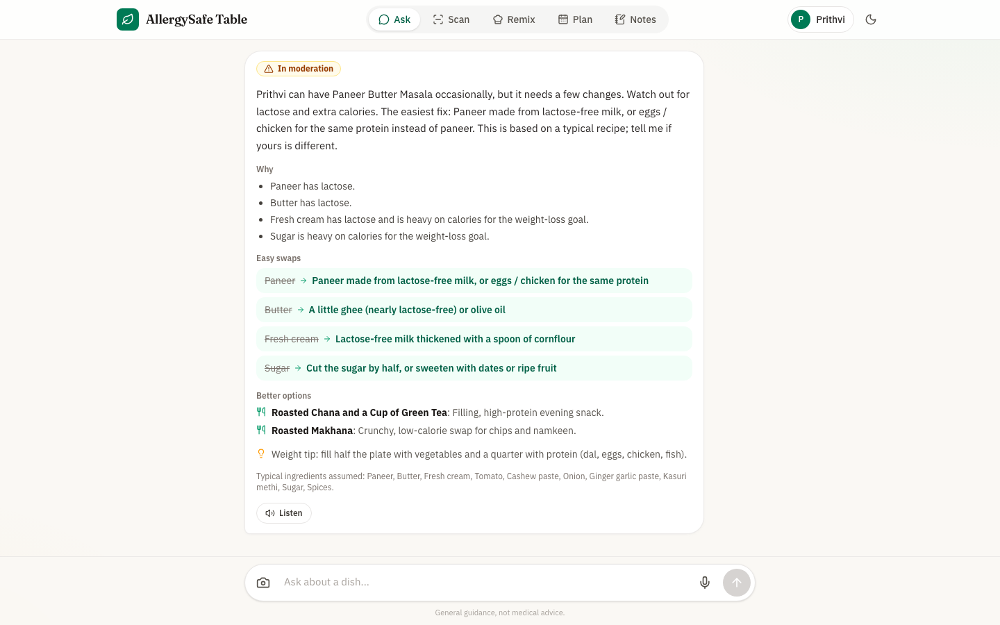
</p>

---

## Features

### Ask in plain words

Type, speak, or send a photo, for example *"Can Prithvi eat paneer butter masala?"* or *"What can she have for breakfast?"*. Each answer gives a clear verdict, the reasons, easy swaps, and healthier options, and can be read aloud. If the app doesn't know a dish, it asks what's in it.

<p align="center">
  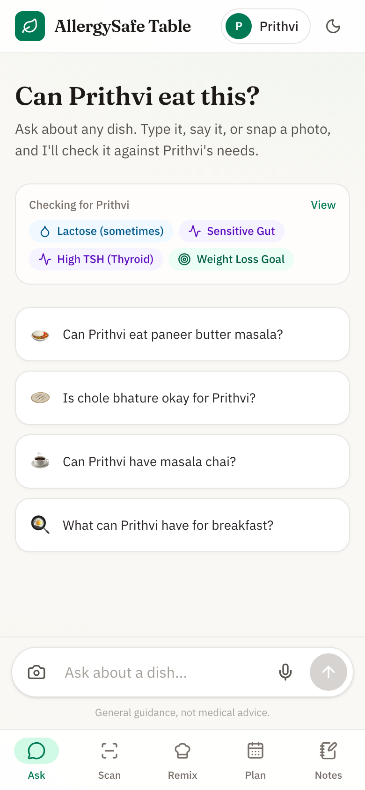
  &nbsp;
  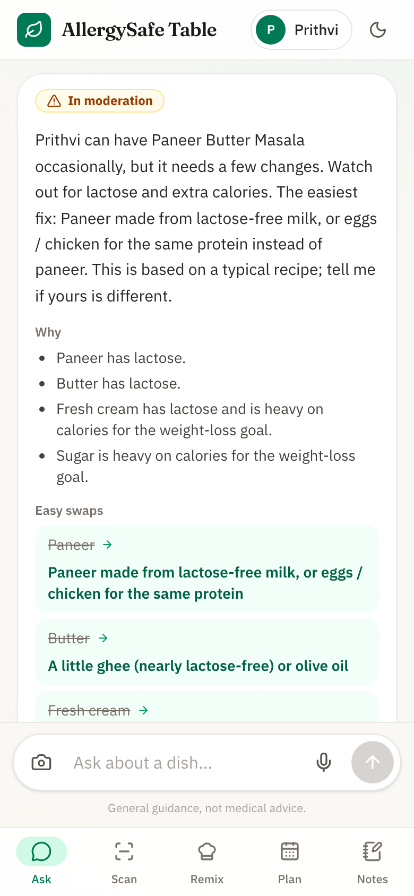
  &nbsp;
  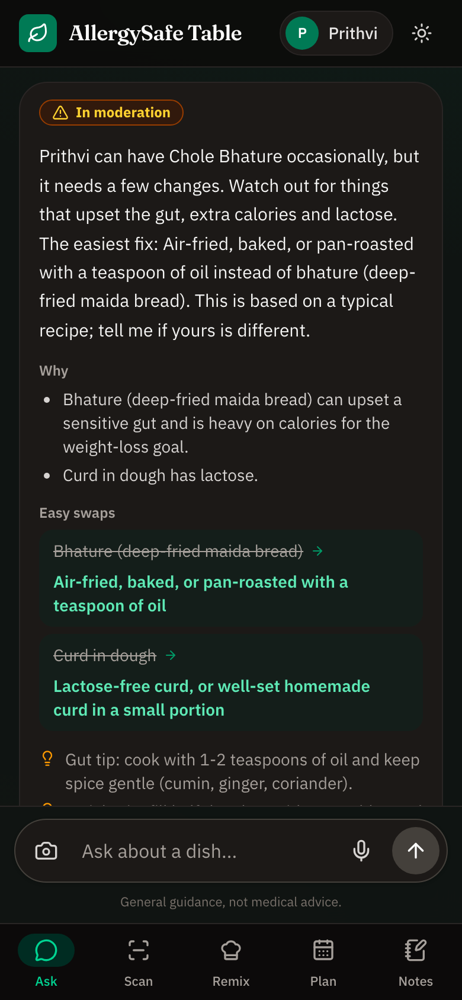
</p>

### Check ingredients or a photo

Paste a recipe or a food label to see exactly what to watch out for, with a swap for each item. Photos work for meals, single ingredients, and packaged food.

<p align="center">
  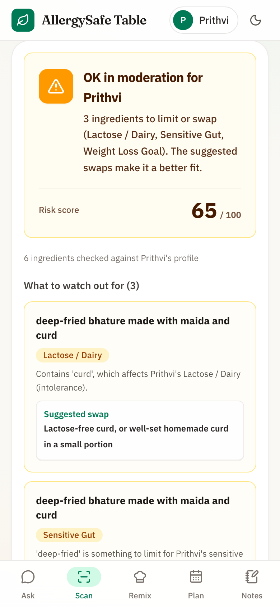
  &nbsp;
  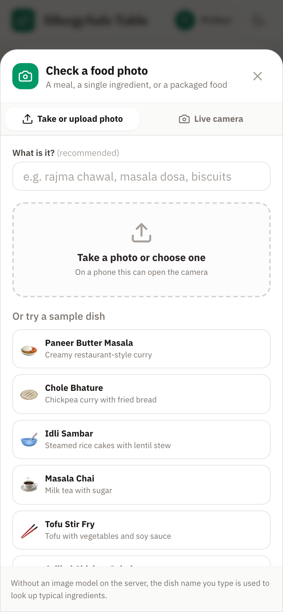
</p>

### Remix a recipe

Swap only the ingredients that don't suit her, and keep the rest of the dish. The steps can be read aloud so you can cook hands-free.

### Plan dinners and keep notes

Plan 3, 5, or 7 dinners that suit her profile, with a shopping list, so everyone eats the same meal. Food notes record what she loved and what didn't sit well.

<p align="center">
  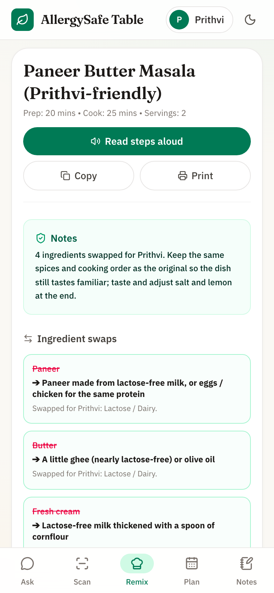
  &nbsp;
  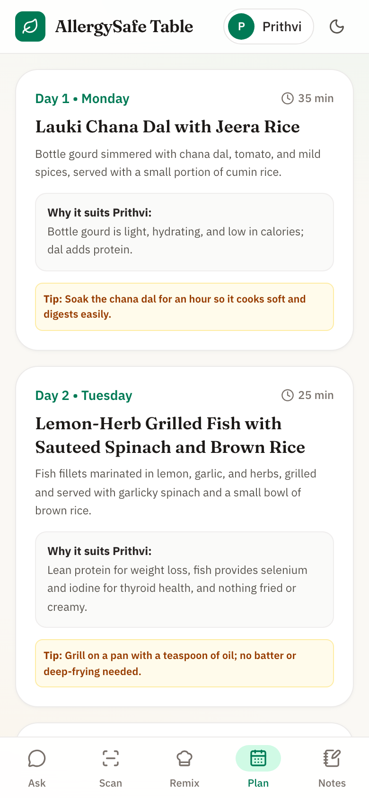
  &nbsp;
  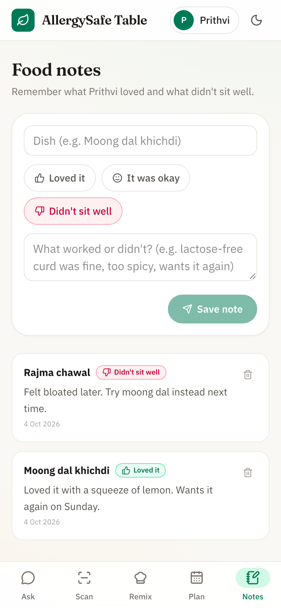
</p>

### Her profile, your way

Each condition explains what to limit and what's fine. The profile is editable, so the app also works for other people and for food allergies. It's saved only on the device.

<p align="center">
  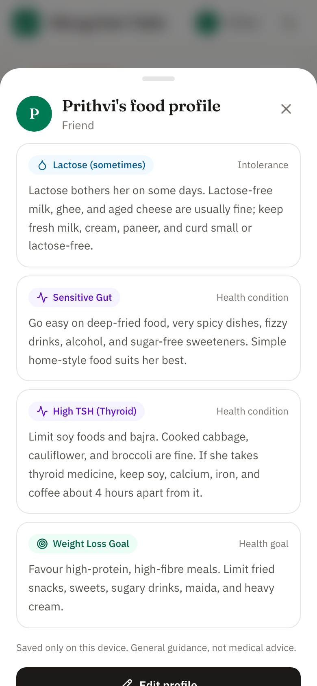
</p>

<p align="center">
  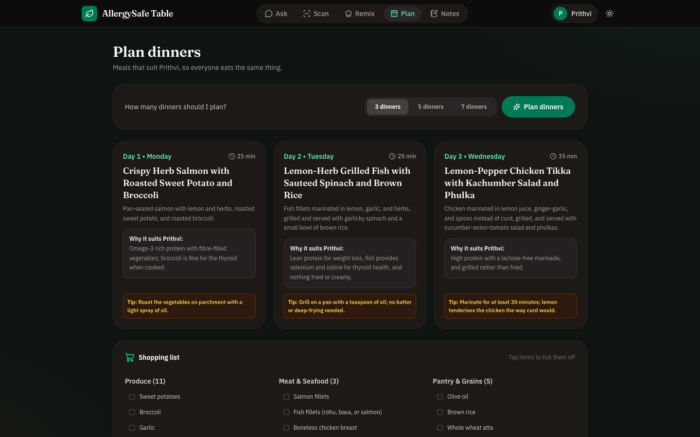
</p>

---

## How the checks work

Every verdict comes from open, readable rules, not from a chatbot guessing.

| In the profile | Result | Examples flagged |
| :--- | :--- | :--- |
| Lactose (sometimes) | In moderation | Milk, cream, paneer, curd, lassi. Ghee is treated as fine. |
| Sensitive gut | In moderation | Deep-fried food, very spicy dishes, fizzy drinks, alcohol, rajma |
| High TSH (thyroid) | In moderation | Soy foods, soya chunks, bajra, large raw cruciferous portions |
| Weight-loss goal | In moderation | Fried snacks, sweets, sugar, maida, heavy cream |
| Food allergies | Not safe | Gluten, nuts, peanuts, dairy, soy, eggs, shellfish, sesame, including hidden sources |

The app knows the typical ingredients of about 80 common Indian and international dishes. Recipes vary, so answers say which ingredients they assumed.

For dishes it doesn't know, a local **Gemma 2 (2B)** model in Ollama suggests the typical ingredients, and the same rules decide the verdict. The model never decides what is safe, and the app shows what it guessed so it can be corrected. Without Ollama, the app asks for the ingredients instead.

> This is general food guidance, not medical advice. Follow a doctor or dietitian for thyroid, gut, and weight concerns.

---

## Tech stack

| Part | Technology |
| :--- | :--- |
| Frontend | Next.js 16, React 19, TypeScript, Tailwind CSS |
| Backend | FastAPI (Python 3.11+) with a rule-based food engine |
| Voice | ElevenLabs: Eleven v4 Turbo for speech and Scribe v2 for voice questions. Falls back to the browser's voice without a key. |
| Open model (optional) | Gemma 2 2B in Ollama: suggests ingredients for unknown dishes. A local vision model (llava, minicpm-v) can also read food photos. |
| Hosting | Render Blueprint (`render.yaml`) |
| CI | GitHub Actions: backend tests on Python 3.11 to 3.13, and a frontend build |

The browser only talks to the Next.js server, which forwards `/api/*` to the backend. Profiles and notes stay in each visitor's browser. Endpoints that use ElevenLabs credits are rate-limited.

---

## Run locally

You need Python 3.11+ and Node.js 20.9+.

```bash
python3 -m venv backend/venv
backend/venv/bin/pip install -r backend/requirements.txt
(cd frontend && npm install)

# Optional: voice. Add your ElevenLabs API key to backend/.env
cp backend/.env.example backend/.env

# Optional: local Gemma 2 for dishes the app doesn't know (about 1.6 GB)
brew install ollama && ollama serve &
ollama pull gemma2:2b

./start.sh
```

Open http://localhost:3000. Voice input and the live camera need HTTPS, so test those on the deployed site. The free Render plan doesn't have enough memory for Gemma, so the deployed site uses the rules only.

Run the tests:

```bash
PYTHONPATH=backend backend/venv/bin/pytest backend/tests -v
(cd frontend && npm run lint && npm run build)
```

---

## Deploy on Render

1. Push this repository to GitHub.
2. In Render, choose **New**, then **Blueprint**, and select the repository.
3. On the backend service, set `ELEVENLABS_API_KEY` under **Environment**.
4. If the backend's URL isn't `https://allergysafe-table-api.onrender.com`, set the frontend's `BACKEND_URL` to the real URL and redeploy the frontend.

Free Render services sleep when idle, so the first request can take up to a minute.

---

## Project structure

```
backend/app/
  api/routes.py            API endpoints
  engine/assistant.py      "Can she eat this?" conversation logic
  engine/food_library.py   Typical dish ingredients and healthy meals
  engine/allergen_knowledge_base.py   Allergens, conditions, and swaps
  engine/safety_analyzer.py           Checks ingredients against a profile
  engine/voice_service.py  ElevenLabs speech and transcription
frontend/src/
  app/page.tsx             App shell and navigation
  components/              Ask, Scan, Remix, Plan, Notes, and profile UI
  lib/                     API client, profile storage, audio helpers
docs/
  screenshots/             Images used in this README
  DEV_SUBMISSION.md        Hackathon write-up
```

---

## Why open source

- **Private:** profiles stay in the browser, Gemma runs on your own machine and only sees dish names, and food checks don't use any third-party AI. ElevenLabs is used only for voice.
- **Checkable:** every verdict traces back to a rule anyone can read and fix.
- **Self-hostable:** runs on a laptop with no paid AI service.
- **Easy to extend:** anyone can add dishes, ingredients, or conditions.
